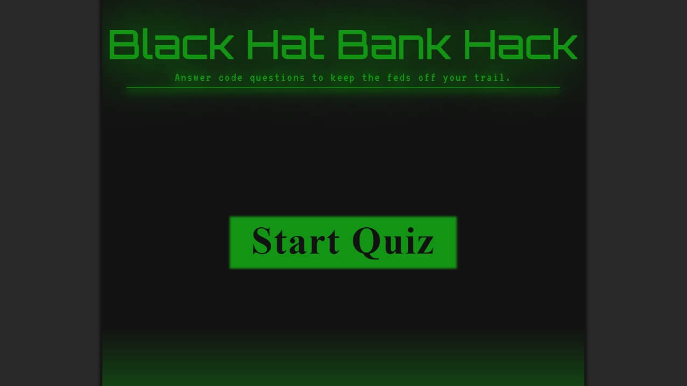

# Programming Quiz

## Description

This quiz is centered around web development. Originally, there was meant to be a lot more fluff (hence the cringe subtitle), however time constrains squashed that idea. The structure of the quiz is complete, and adding additional questions (or changing the theme of them entirely) would be trivial.

## Features

Seven programming questions on a timer. Wrong answers subtract from your time (and also give a penalty so clicking fast doesn't give you a higher score). Score is tallied at the end. High scores are also saved in local storage, so try to top your best!

This project includes a bit of scripting for the structure of the quiz, including randomly selecting your next question and sorting the highscores (and culling the worst ones).

## Installation

Visit [this link](https://axeljk.github.io/uw_m04_quiz/) to view.

 ## Credits

- Axel Kern, creator
- W3Schools, reference for CSS and JS
- Stack Overflow, answering questions before I had them
- Abbey Free, supporting me in all things

## License

This project falls under the MIT license.